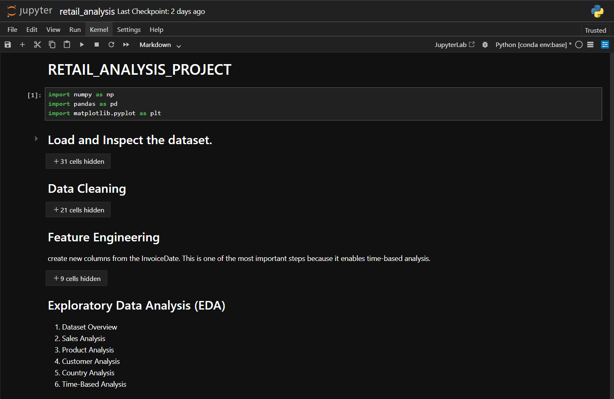
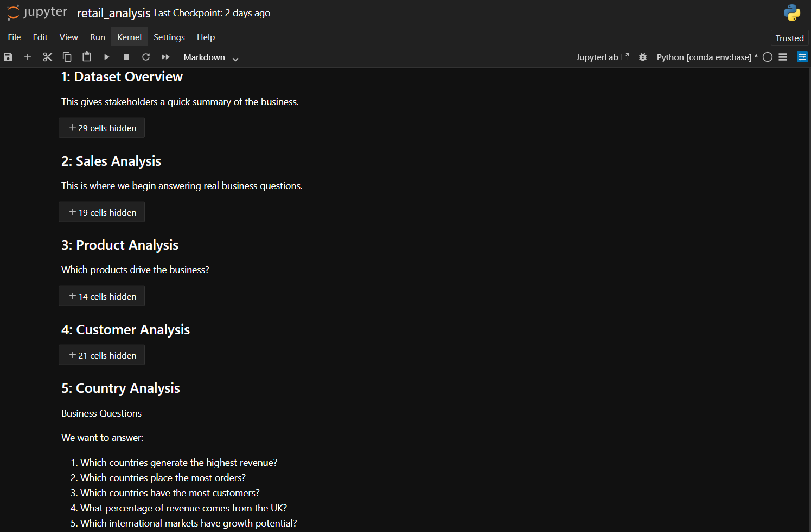
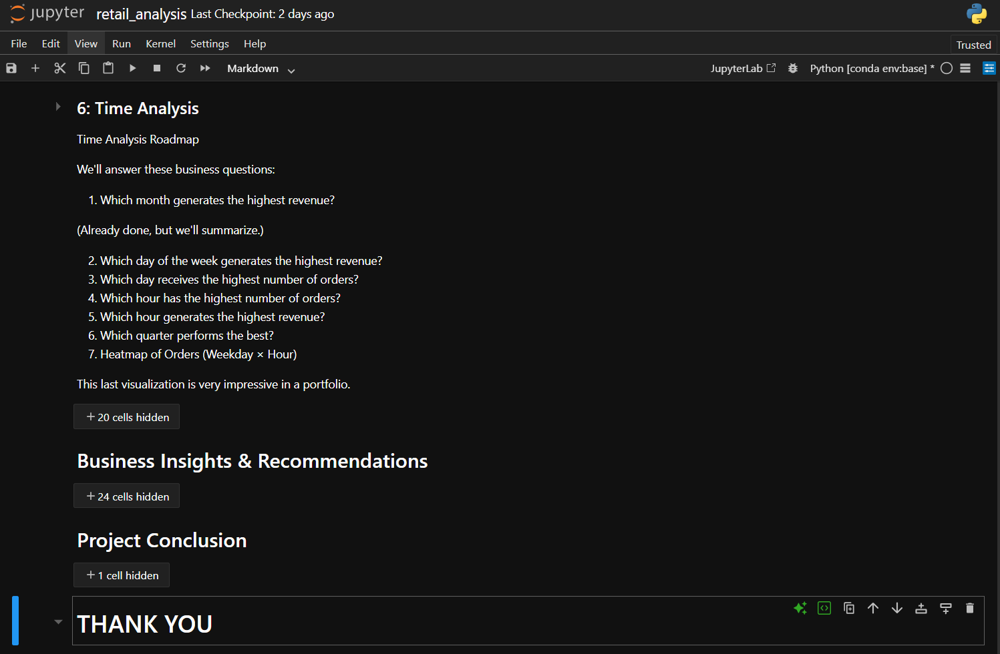

# 📊 Online Retail Sales Analysis using Pandas

> End-to-End Data Analytics Project using **Python**, **Pandas**, **NumPy**, **Matplotlib**, and **Seaborn**.


---

## 📌 Project Overview

This project performs an end-to-end analysis of a real-world **Online Retail** dataset containing over **500,000 retail transactions** from an international e-commerce business.

The primary objective is to analyze customer purchasing behavior, product performance, sales trends, geographical distribution, and time-based shopping patterns to generate actionable business insights.

The project demonstrates the complete Data Analytics workflow—from data cleaning and feature engineering to exploratory data analysis (EDA), visualization, and business recommendations.

---

## 🎯 Objectives

- Clean and preprocess raw retail transaction data
- Perform exploratory data analysis (EDA)
- Identify sales trends and seasonal patterns
- Analyze customer purchasing behavior
- Discover top-performing products
- Evaluate country-wise sales performance
- Analyze shopping patterns over time
- Generate business insights and recommendations

---

## 🛠️ Technologies Used

- **Python**
- **Pandas**
- **NumPy**
- **Matplotlib**
- **Seaborn**
- **Jupyter Notebook**

---

## 📂 Dataset Information

- **Dataset:** Online Retail Dataset
- **Source:** UCI Machine Learning Repository (via Kaggle)
- **Records:** 541,909+
- **Features:** 8
- **Business Domain:** E-Commerce / Retail

### Dataset Columns

- InvoiceNo
- StockCode
- Description
- Quantity
- InvoiceDate
- UnitPrice
- CustomerID
- Country

---

# 📋 Project Workflow

```
Data Collection
        │
        ▼
Data Understanding
        │
        ▼
Data Cleaning
        │
        ▼
Feature Engineering
        │
        ▼
Exploratory Data Analysis
        │
        ▼
Business Insights
        │
        ▼
Business Recommendations
```

---

# 🧹 Data Cleaning

The following preprocessing steps were performed:

✔ Removed duplicate records

✔ Removed cancelled transactions

✔ Removed negative quantity values

✔ Removed invalid unit prices

✔ Handled missing product descriptions

✔ Retained missing Customer IDs for sales analysis

✔ Created Revenue column

✔ Converted InvoiceDate to datetime

---

# ⚙️ Feature Engineering

New features created:

- Revenue
- Year
- Month
- Month Name
- Day
- Day Name
- Hour
- Quarter
- Weekday

---

# 📊 Exploratory Data Analysis

The project includes the following analyses:

## 📈 Sales Analysis

- Total Revenue
- Monthly Revenue Trend
- Quarterly Revenue
- Average Order Value

---

## 📦 Product Analysis

- Top Selling Products
- Highest Revenue Products
- Most Frequently Ordered Products

---

## 👥 Customer Analysis

- Top Customers by Revenue
- Top Customers by Orders
- Customer Purchase Frequency
- Customer Summary

---

## 🌍 Country Analysis

- Revenue by Country
- Orders by Country
- Customers by Country
- Revenue Contribution by Country

---

## ⏰ Time Analysis

- Revenue by Weekday
- Orders by Weekday
- Orders by Hour
- Revenue by Hour
- Revenue by Quarter
- Weekday vs Hour Heatmap

---

# 📌 Key Findings

- 💰 Generated over **£10.64 Million** in completed sales.
- 📈 November recorded the highest monthly revenue.
- 📉 February had the lowest sales performance.
- 🏆 The United Kingdom generated the highest revenue.
- 👑 Customer **14646** was the highest revenue-generating customer.
- ⭐ DOTCOM POSTAGE generated the highest product revenue.
- 🕛 Most purchases occurred between **10 AM and 3 PM**.
- 📅 Thursday generated the highest revenue.
- 🌎 The business serves customers across **38 countries**.
- 👥 More than **4,300 unique customers** were analyzed.

---

# 💡 Business Recommendations

- Launch marketing campaigns during low-sales months.
- Expand business into high-potential international markets.
- Introduce loyalty programs for high-value customers.
- Maintain sufficient inventory for top-selling products.
- Schedule promotions during peak shopping hours.
- Increase operational capacity during Q4.

---

# 📷 Project Visualizations

The project includes professional visualizations such as:

- Monthly Revenue Trend
- Top Products
- Country Revenue
- Customer Revenue
- Revenue by Weekday
- Orders by Hour
- Revenue by Quarter
- Orders Heatmap
  
---

# 📂 Dataset

Due to GitHub's file size limitations, the dataset is **not included** in this repository.

You can download it from the following source:

🔗 **Kaggle:**  
https://www.kaggle.com/datasets/vijayuv/onlineretail

📌 **Original Source (UCI Machine Learning Repository):**  
https://archive.ics.uci.edu/dataset/352/online+retail
---

# 📸 Project Screenshots

## 📊 Dashboard 1 – Dataset Overview & KPIs

<p align="center">
  
</p>

---

## 📈 Dashboard 2 – Sales & Product Analysis

<p align="center">
  
</p>

---

## 🌍 Dashboard 3 – Customer, Country & Time Analysis

<p align="center">
  
</p>

---

---

# 📚 Skills Demonstrated

- Data Cleaning
- Data Wrangling
- Exploratory Data Analysis (EDA)
- Business Analytics
- Feature Engineering
- Data Visualization
- Customer Analytics
- Sales Analytics
- Pandas
- NumPy
- Matplotlib
- Seaborn

---

# 🚀 Future Improvements

- Power BI Dashboard
- Interactive Plotly Visualizations
- Customer Segmentation (RFM Analysis)
- Cohort Analysis
- Sales Forecasting
- Machine Learning Models

---

# 👨‍💻 Author

## Pranav Khobragade

**Aspiring Data Analyst | Python | SQL | Power BI | Excel**

🌐 Portfolio: https://pranavkhobragade.online

💼 LinkedIn: https://www.linkedin.com/in/pranav-khobragade/

🐙 GitHub: https://github.com/Prnv-code

---

⭐ If you found this project helpful, don't forget to **Star** the repository!
